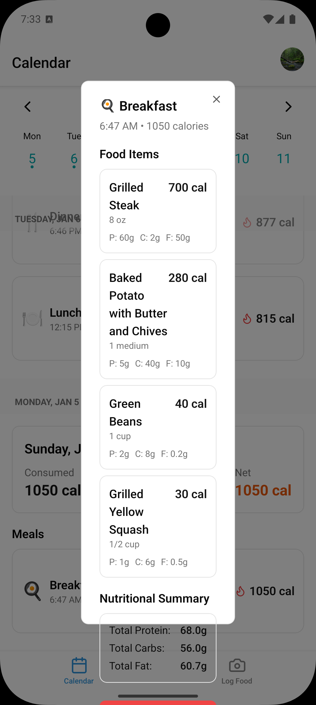
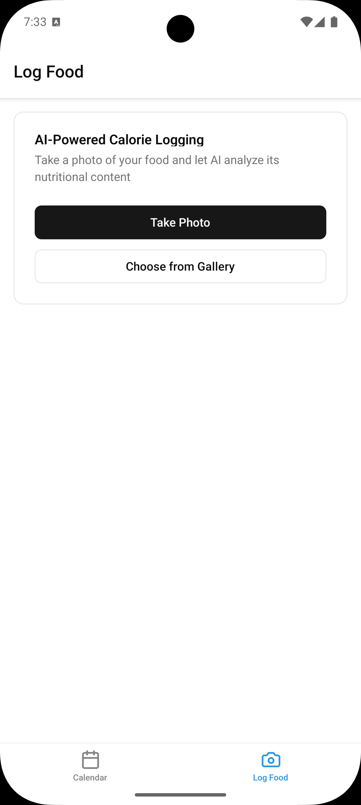
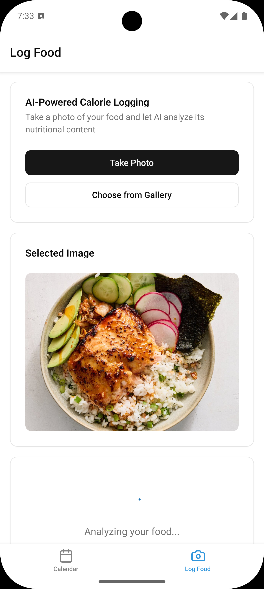
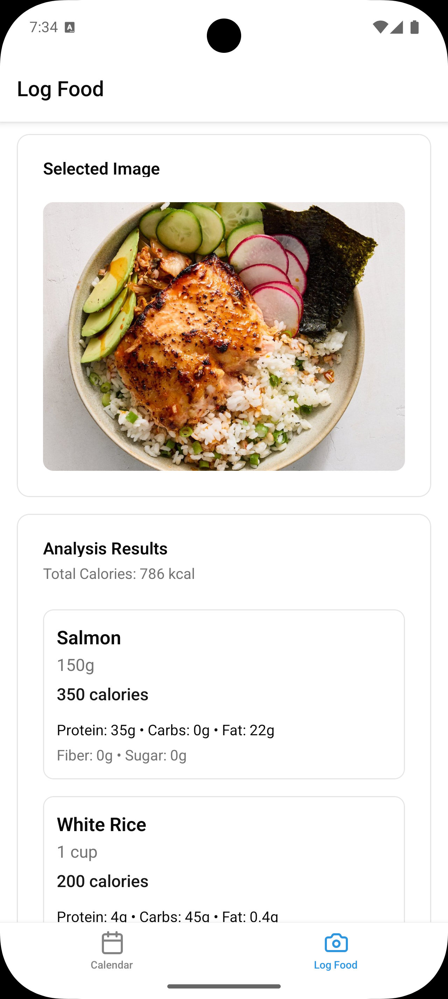
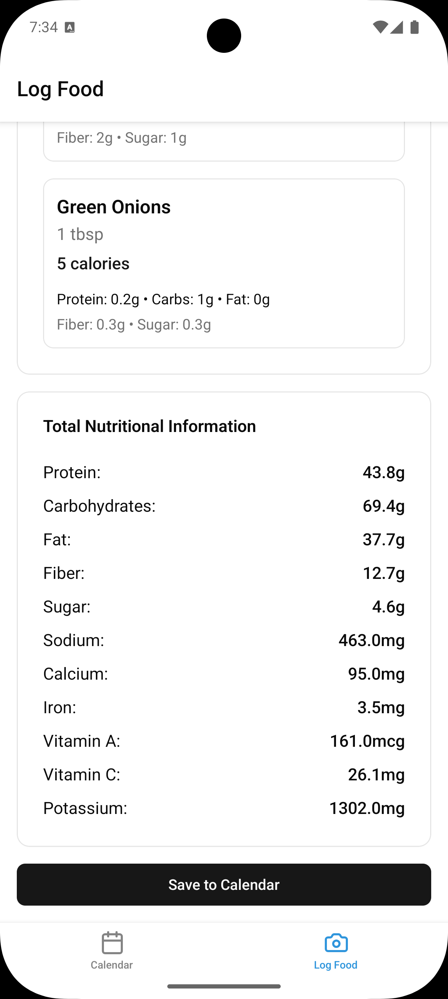

# Fitness Tracker with AI-Powered Calorie Logging

An intelligent fitness tracking application that combines calendar-based activity logging with AI-powered image analysis using Google Gemini. Track your calories, workouts, runs, and health metrics seamlessly with the power of artificial intelligence.

## Overview

This fitness tracker revolutionizes how you log your health and fitness activities by leveraging AI technology. Simply take a photo of your food, and let Google Gemini do the heavy lifting of analyzing and logging your activities.

## Screenshots








## Key Features

### AI-Powered Calorie Logging

- **Smart Food Recognition**: Take photos of your meals and let Google Gemini automatically identify all food items
- **Detailed Nutritional Analysis**: Get comprehensive nutritional information including:
  - Individual calorie counts for each food item
  - Complete nutrient breakdown (similar to nutrition labels)
  - Vitamins and minerals content
  - Total meal calories
- **Calendar Integration**: All logs are automatically saved to your personal calendar with full edit capabilities

### Calendar-Based History

- View all your logged activities in an organized calendar format
- Edit and update past entries as needed
- Track your fitness journey over time

### User Authentication

- Secure sign-in and sign-up functionality
- Password reset and recovery options
- Firebase-powered authentication system

## �🛠️ Tech Stack

- **Framework**: [React Native](https://reactnative.dev/) with [Expo](https://expo.dev/)
- **Navigation**: [Expo Router](https://expo.dev/router)
- **Styling**: [Tailwind CSS](https://tailwindcss.com/) via [NativeWind](https://www.nativewind.dev/)
- **UI Components**: [React Native Reusables](https://reactnativereusables.com)
- **Backend**: [Firebase](https://firebase.google.com/)
- **AI Engine**: Google Gemini
- **Forms**: React Hook Form with Zod validation
- **Calendar**: React Native Calendars
- **Type Safety**: TypeScript
- **Image Selection**: Expo Image Picker

## 🚀 Getting Started

### Prerequisites

- Node.js (v18 or higher)
- pnpm, npm, yarn, or bun
- Expo CLI
- iOS Simulator (Mac only) or Android Emulator

### Installation

1. Clone the repository:

```bash
git clone https://github.com/anthonytoyco/fitness.git
```

2. Install dependencies:

```bash
pnpm install
# or
npm install
# or
yarn install
```

3. Configure Firebase:
   - Create a Firebase project at [Firebase Console](https://console.firebase.google.com/)
   - Add your Firebase configuration to the `.env` file

4. Set up Google Gemini API:
   - Obtain API credentials from [Google AI Studio](https://makersuite.google.com/)
   - Add your API key to the `.env` file

### Running the App

Start the development server:

```bash
pnpm dev
# or
npm run dev
```

Open the app:

- **iOS**: Press `i` to launch in the iOS simulator _(Mac only)_
- **Android**: Press `a` to launch in the Android emulator
- **Web**: Press `w` to run in a browser
- **Physical Device**: Scan the QR code with the [Expo Go](https://expo.dev/go) app

## Usage

1. **Sign Up/Sign In**: Create an account or log in to access your personal fitness tracker
2. **Log Meals**: Navigate to the entry tab, take a photo of your food, and let Gemini analyze it
3. **View History**: Check your calendar to see all logged activities
4. **Edit Entries**: Tap on any calendar entry to view details or make adjustments

## 🔮 Roadmap\*

- [ ] Complete Google Gemini integration for food image analysis
- [ ] Implement voice-to-text activity logging
- [ ] Workout session tracking
- [ ] Running/cardio activity logging
- [ ] Health status monitoring
- [ ] Progress charts and analytics
- [ ] Social sharing features
- [ ] Goal setting and achievement tracking
- [ ] Meal planning suggestions
